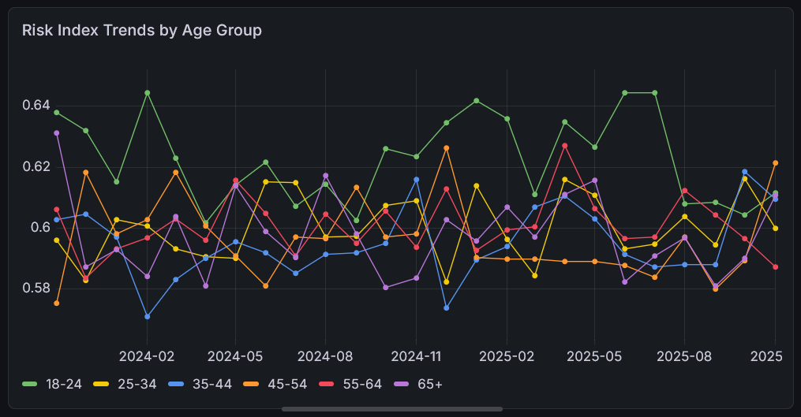
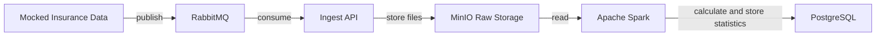

# Insurance Risk Pipeline

The project demonstrates an end-to-end insurance risk processing pipeline 
that transforms raw insurance records into segmented risk statistics. 
The resulting metrics can be used for reporting, analytics, and risk assessment, 
supporting both automated and manual decision-making.

## Example: Risk Analysis Output



The chart presents monthly risk index trends across insured age groups, calculated from aggregated insurance claim data.

The custom risk index combines:
- loss ratio
- fraud rate
- claim severity

SQL: [risk-index-age-group.sql](docs/queries/risk-index-age-group.sql)

## Stack
- Scala 3 / Scala 2.12 (Spark job), on JDK 17
- RabbitMQ
- PostgreSQL
- Akka HTTP/Streams
- Apache Spark
- Grafana
- Minio / S3

### How it works


1. Data generator simulates a production system streaming claim data:
   - source: https://www.kaggle.com/datasets/ahluwaliasaksham/car-insurance-fraud-detection-dataset
   - raw insurance records are read and published to a RabbitMQ queue
   - simulates how a real system would emit events, given only a static dataset
2. Raw events are consumed from the queue and stored in MinIO for later processing
3. Spark job reads raw events and computes risk statistics that:
   - can be used for system or human decision-making
   - can run as a single job or on a schedule
4. Results are stored in PostgreSQL.
5. Grafana is used to visualize calculated risk statistics.

## How to run
### Prerequisites
- Docker & Docker Compose
- SBT (install globally from https://www.scala-sbt.org/download.html,
  or run with IntelliJ: right panel -> sbt -> assembly)

### Build all jars
```bash
sbt assembly
```

### Start with Docker
```bash
docker-compose up -d --build
```

### MinIO raw & events storage
Access at: http://localhost:9001 \
credentials: \
username: minioadmin \
password: minioadmin

### Grafana dashboard
Access at: http://localhost:3000/ \
credentials: \
username: admin \
password: admin

