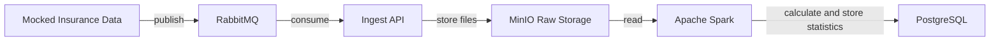

# Insurance Risk Pipeline

A data engineering pipeline simulating a real-world insurance risk assessment system. 
It demonstrates an end-to-end flow from event-driven data ingestion through 
distributed processing to risk analytics.

## Stack
- Scala 3 / 2 (on JDK 17)
- RabbitMQ
- PostgreSQL
- Akka HTTP/Streams
- Apache Spark
- Apache Superset
- Minio / S3

### How it works


1. Data generator simulates a production system streaming claim data:
   - source: https://www.kaggle.com/datasets/ahluwaliasaksham/car-insurance-fraud-detection-dataset
   - raw insurance records are read and published to a RabbitMQ queue
   - simulates how a real system would emit events, given only a static dataset
2. Raw events are consumed from the queue and stored in MinIO for later processing
3. Spark job reads raw events and computes risk statistics that:
   - can be used for system or human decision-making
   - can run as a single job or on a schedule
4. Results are stored in PostgreSQL
5. Apache Superset to displays a statistics in dashboard

## How to run
### Prerequisites
- Docker & Docker Compose
- SBT (install globally from https://www.scala-sbt.org/download.html,
  or run with IntelliJ: right panel -> sbt -> assembly)

### Build all jars
```bash
sbt assembly
```

### Start the stack
```bash
docker-compose up -d --build
```

### MinIO raw & events storage

can enter with http://localhost:9001 \
credentials: \
username: minioadmin \
password: minioadmin

### Apache Superset & risk statistics dashboard

can enter with http://localhost:8088/ \
credentials: \
username: admin \
password: admin \

